# IRIS Labs Hardware Recruitments - 2026 - Assignment 1

## 📋 Table of Contents :

- [Part A](#part-a-)
    - [Problem Statement](#problem-statement-)
    - [Questions](#questions-)
- [Part B](#part-b) 
    - [Objective](#objective-)
    - [Design Sources](#design-sources)
    - [Processor Block Design](#processor-block-design-)
    - [Design Choices](#design-choices-)
    - [Simulation Results](#simulation-results-)
    - [Optimizations](#optimizations-)
- [Part C](#part-c)
    - [Objective](#objective)
    - [Integration process](#integration-process)
    - [Architectural Diagram of the SoC](#architectural-diagram-of-the-soc-)
    - [Simulation Results](#simulation-results--1)
    - [Terminal/tcl Output](#results-printed-on-the-terminal-due-to-the-uart-module-of-the-risc-v-soc-click-the-below-text)
- [Optimizations - DMA CONTROLLER](#optimizations)
    - [Design Process](#design-process)
    - [Integration with the SoC](#integration-with-the-soc)
    - [DMA Schematic](#dma-controller-schematic-)
    - [Terminal Outputs](#terminal-outputs)
- [References](#references)

---
## Part A :

### Problem Statement :

- In the Bclk domain, the encoded 3-bit binary code, b[2:0] transitions from 000 to 111. But b[1] & b[2] go high (1) 'late' (by a few ps) which causes a skew in the waveform.
- The issue here isn't metastability (which is taken care of by the flip flop synchronizers either ways) as there is no case of uncertain outputs, rather its about a certain, wrongly sampled data in the Aclk domain, here, b[1] & b[2] incorrectly sampled at aq1[1] and aq2[2] respectively.  
- If these 2 bits had turned high along with b[0], then we could've observed in the waveforms that the moment adec[0] goes low, adec[7] would've gone high without any intermediate invalid signals.

### Questions :

**1. Why does synchronizing each bit of an encoded multi-bit control signal independently lead to incorrect decoding in the receiving clock domain?**

- Synchronizing individual bits of a multi-bit control signal shouldn't seem like a problem given, there is no presence of skew, which unfortunately is never the case in real life applications as the change in the value of a particular bit is unpredictable. Hence even a picosecond of advance or delay of any bit (here, delay of b[1] & b[2]) in the data, causes a skew in the waveform
- This consequently leads to incorrect sampling and invalid outputs. When such outputs are used together as a control signal, then it leads to generating unexpected decoded outputs.
- Also, The fundamental flaw of independent synchronization is that it destroys data coherency (causes skew). A flip flop synchronizer is not a fixed-delay pipe as its latency is dependent on exactly when the input signal violates the setup/hold window.

**2. How does the skew between b[1] (& b[2]) and b[0] cause adec[2:0] to momentarily take an invalid intermediate value?**

- According to the waveform given, b[2:0] transitions from 000 to 111 in the Bclk domain. The same must happen in the Aclk domain 
w.r.t to its own clock cycles, after using synchronizers to reduce metastability. But b[0] goes high before the next positive edge of the clock, unlike b[1] & b[2]. 
- This leads to b[1] & b[2] being incorrectly sampled as 0 when b[0] is 1, which is what causes the misalignment of all ones(7). So these bits don't arrive together at the decoder. 
- Hence, the expected of result of adec[0] = 1 when all bits are zero and adec[7] = 1 when all bits are 1, is disrupted by that one clock cycle in which adec[2:0] = 001. This leads to an invalid intermediate value where the decoder outputs adec[1] = 1 for this particular clock cycle.

*Real-life Analogy:
Lets say, 3 people, p[2:0], want to take a photo of them jumping (111). Initially all them are on the ground (000). During the process of clicking the photo consecutively, they plan to jump together to get the right photo. But 
p[1] & p[2] jump just after p[0] does(unplanned 001 result). After a while, the required photo is taken but the collection now includes an unwanted photo (001). 
Now imagine this process being done individually. If their individual photos are clubbed together after taking multiple photos, there's higher chances of getting intermediate results.*

**3. What is the fundamental CDC design mistake illustrated in this problem statement?**

- The problem encountered in this design is the "Synchronization of skewed - induvidual bits of a multi-bit signal being transferred between 2 different clock domains".

**4. Suggest any three different design techniques that can be used to safely transfer this control information across clock domains without generating spurious decoded outputs.**

1. **Binary to Gray code conversion:** 
- This conversion is usually used to reduce metastability, consequently increase MTBF as it reduces the frequency of data toggles, but it also fixes the skew problem as any wrong sampling in case of gray code results in the old, existing data or its next value, not any possible random number.  
**Binary: 0 to 7 i.e. 000 to 111 has a 3 bits changing. Hence 8 (2^3) possible numbers (0,1,2,3,4,5,6,7) can be sampled due to unpredictable behaviour causing skews.*  
**Gray: 0 to 7 i.e. 000 to 100 has only 1 bit changing. Hence 2 (2^1) possible numbers (0 or 7) can be sampled. This is because the other two bits are 0 throughout.*

2. **Asynchronous FIFO:** 
- Even though asynchronous FIFO contains the above explained binary to gray converter, it resolves the skew problem by its functionality as a buffer. It doesn't fix the glitchy data, rather ensures that the data is never put in a position to be glitched/wrongly sampled. 
- It stores the data being written from Bclk domain and allows it to be read by the Aclk domain whenever, until which the clock cycle in which wrong sampling occurs never happens in the other domain as the data is still in the FIFO.

3. **Valid/Ready Handshake mechanism:** 
- Practical implementation of the Multi-Cycle Path (MCP) formulation which based on the principle of sending feedback signals between the clock domains to ensure safe sampling of data. Bclk domain holds its data steady and sends a request(req/valid) signal.  
*Note: Every signal mentioned here: req or valid, ack or ready, must go through the flip flop synchronisers while entering the other clock domain.* 
- When receiver gets the 'valid' signal, it sends back a 'ready' signal which when received by the sender indicates that the steady data can now be sampled and it can be changed for the next transfer.

---

## Part B:
   *Note: I have extensively commented the RTL modules attached, which state the explanations, logic and key points near the corresponding code/design. This README file only summarises the design & implementations, displays schematic diagrams and justifies the architectural choices made over other alternate choices*

### Objective :
    Designing a hardware accelerator that receives a stream of data elements asynchronously from the data producer, performs a specific operation on each element and streams out the processed data.

### Design Sources:
-   **Data Producer** [(data_prod.v)](Part_B/data_prod_proc/data_prod.v)   :  
    This block continuously produces '8 bit data bursts' in the form of pixels and streams it to the data processor.

-   **Data Processor** [(data_proc.v)](Part_B/data_prod_proc/data_proc.v)  :  
    This block receives the pixel values and performs operations on it based on the control signal 'Mode'. It also maps the mode register and the kernel register (used for convolution operation) to respective addresses.

-   **Asynchronous FIFO** [(async_fifo_top.v)](Part_B/data_prod_proc/async_fifo_top.v)   :  
    A multi-functional component present in the processor, which,
    - Handles the cross domain crossing mechanism between the producer & the processor 
    - Acts as a buffer that can store upto 1024 incoming pixels from the producer.
    - Facilitates handshake synchronizing between producer and processor using the logic of its flags i.e. full & empty to generate the 'valid' and 'ready' signals which account for precise data transfer such that no garbage value is produced.

### Processor Block Design :
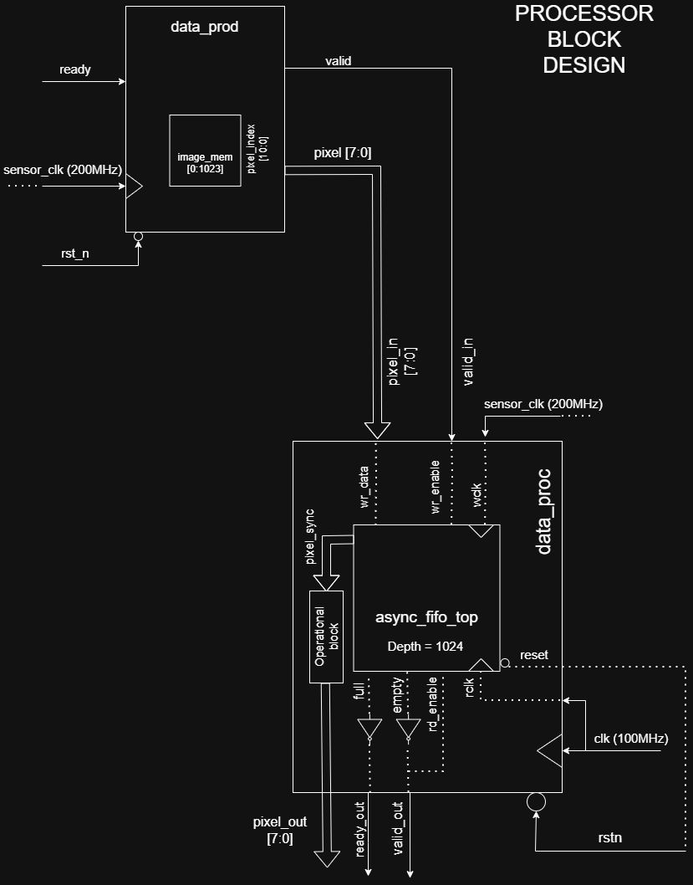

### Design Choices :

1. Asynchronous FIFO instantiated inside the processor block rather than placing it as a seperate block in between producer and processor.
    - This design was opted because it creates a self-contained CDC boundary i.e. in a practical scenario, if the FIFO is kept external, then the user will have to manually set up the clocks, use the flags as handshake signals, meanwhile, while integrating this with the given RISC V SoC in Part C, you would have to separately connect the processor first and then the FIFO along with it, which isn't feasible. 
    - Keeping it internal, makes our processor a robust IP that handles CDC. It makes our design portable i.e. plug and play mechanism which prevents us from the complex wiring everytime the processor is used in a different SoC.
    - The internal flags and the synchronized data streamed out of the FIFO from it's Read domain is directly accessed by the processor, which reduces latency and allows for a read on-demand design.
    
2. Valid/Ready interface using Fifo's flag signals. 
     - Rather than using a seperate protocol to facilitate the handshake mechanism between producer and processor, the FIFO provides an added advantage of notifying the condition of the memory which can be used by the producer i.e. whether a new data should be sent or by the processor i.e. whether it can accept any new synchronized data pixels. 
     -  valid = !(empty)  ready= !(full)
3. FIFO Depth = B*(1- (f(rclk)/f(wclk))) where, 
    - B : Total number of bursts of data provided to the FIFO, here, 1024.
    - f(rclk) = 100 MHz
    - f(wclk) = 200 MHz
    - Calculated FIFO depth = 512
    - Accounting for the asynchronous latency, on a safer side, a higher depth is to be chosen to avoid filling the FIFO quickly. 
        - FIFO Depth = 1024

4. Convolution operation: 
     - A kernel is loaded into the registers mapped to the given memory address. It acts as a stencil which performs MAC operation over the data window. The kernel chosen here is an identity kernel which helps in the operation verification as output must be equal to the input. 
     - Line buffers and shift registers are used to realign the stream of synchronized pixels into a window of 3 rows so that continuous MAC operations can be carried out. 
         - The width of the line buffer is 32 bits. 
         - Since there are 2 such buffers (i.e. 64 bits) and for a convolution operation you need have a 3 X 3 data window, we wait for the next 3 bits to show up on the current input wire. Thus, when mode is just assigned as 2'b10, there is a 67 clock cycle delay until you can see the first output. After the first output, every next clock cycle produces a new output. 

### Simulation Results : 

1. Mode 0: 
    
 

2. Mode 1: 
    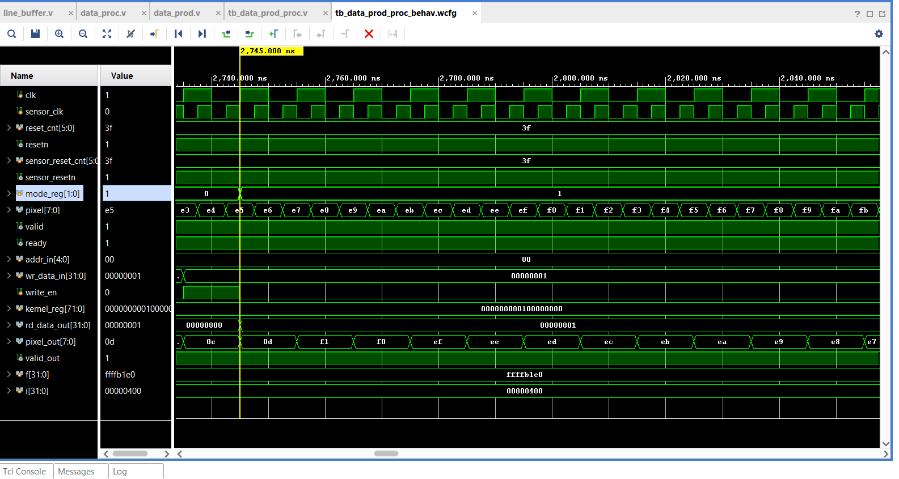 

    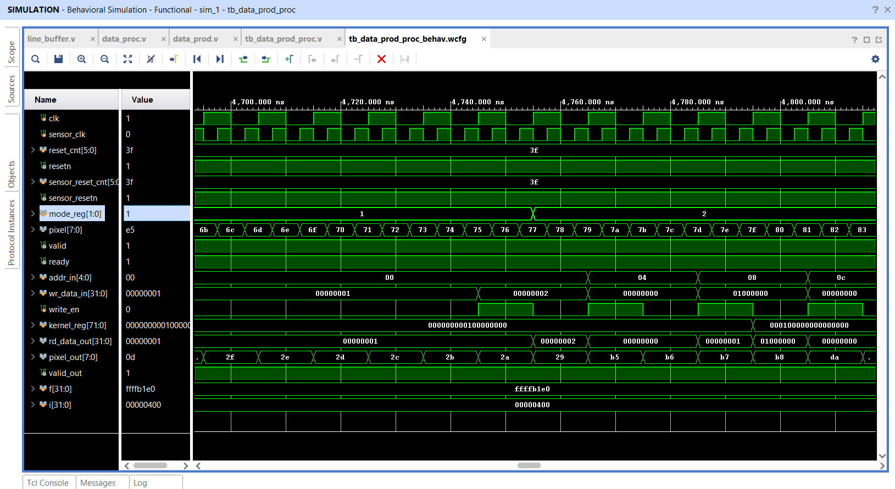
 

3. Mode 2: 
    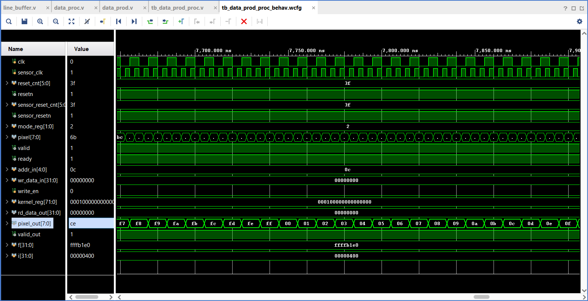

### Optimizations :

1. FWFT-optimized Asynchronous FIFO:
    - One of the key optimizations I implemented in the processor is to support FWFT in my FIFO i.e. First Word Fall Through.
      I noticed that in the standard FIFO, after every 'read enable' from the processor, the output is received from the FIFO after one clock cycle. This one clock cycle latency introduces a dependency loop  which results in a 'bubble' cycle where no data moves in the processor.
    - So this feature just pre-fetches the first output before the read enable is activated. Hence, there's an instant output available without any latency in the FIFO's output. Even the 'valid' signal (i.e. !empty) becomes a direct output of the FIFO. 
    - This does increase area and power consumption but they are negligible as the area factor is just due to an additional wrapper module [(fwft_wrapper.v)](Part_B/data_prod_proc/fwft_wrapper.v) and the power difference is undetectable compared to the producer which streams data constantly anyways.

    *Real-life analogy:  
    Imagine you go to a cafe. For the standard FIFO, the equivalent scenario would be: You order a coffee, wait for 5 minutes and then receive it later. For every order, you will have to wait 5 minutes. But if FWFT is implemented, the scenario would be: You enter the cafe and there's already a coffee ready for you! Zero latency.  
    You will notice these signals in the FIFO modules: empty_fifo & rd_enable_fifo (internal signals of the FIFO) and empty (!valid) & rd_enable (user control signals). They are explained here:
    The coffee is ready on a tray already but now its upto you if you want to take it or not (rd_enable). If the tray is empty, that corresponds to 'empty' or '!valid'. If the cafe runs out of fresh coffee beans, that is defined as 'empty_fifo' since its an internal problem. FWFT features make sure that 'if the tray is empty, send the next coffee out irrespective of whether the customer has ordered it or not.*

    Simulation waveforms:
    Observe the signal 'pixel_out'. It gets streamed out after a clock cycle in the standard FIFO. With FWFT, it is streamed out immediately i.e. when empty signal goes low. 

    ### **Without FWFT**: 
    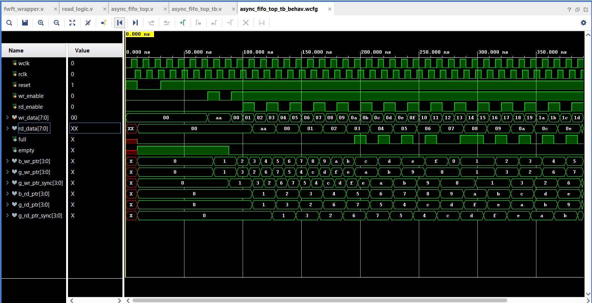

    ### **With FWFT**:
    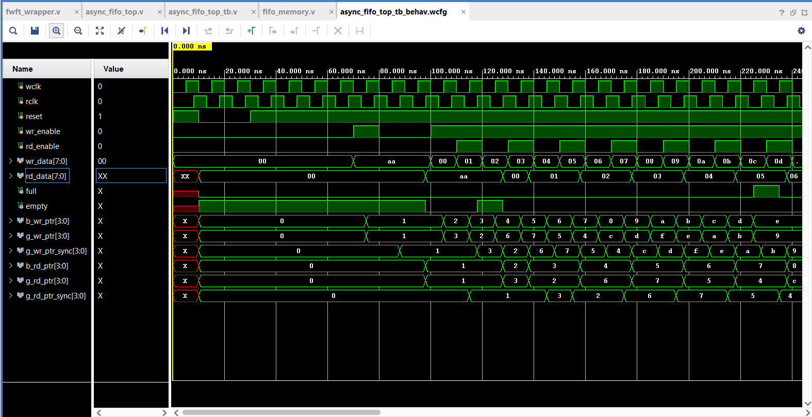

    ### **Mode 0 results with FWFT**: 

    The FWFT effect can be clearly seen when you observe the pixel and pixel_out here and in the Mode 0 results under "Simulation Results". The difference between pixel and pixel_out for a particular clock cycle is a lot for the processor without FWFT, while it is very less for the FWFT version, indicating reduced latency.
     

    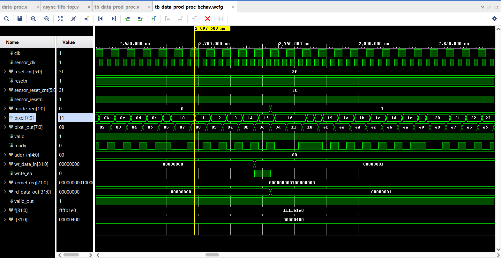

2. Clock gating the memory of the FIFO [(fifo_memory.v)](Part_B/data_prod_proc/fifo_memory.v): 
    - One of the most significant optimizations implemented to reduce power consumption. 
    - The process of switching the clock off when there is no read or write action (i.e. usually when FIFO is full or empty).
    - Only the clocks of the FIFO memory (both read and write clocks) are gated as it is the component that does most of the heavy lifting functions. 
    - Note that we don't gate the clocks of write_logic [(write_logic.v)](Part_B/data_prod_proc/write_logic.v) and read_logic [(read_logic.v)](Part_B/data_prod_proc/read_logic.v) as these modules decide when to activate wr_enable i.e. activates the clock again after being gated. 
    - We don't gate the clocks of the synchronizers either as they have to monitor the write and read pointers all the time as they are the ones that decide the logic for whether the FIFO is full or empty.
    - Logically, write_clk_gated = write_clk & write_enable. But we should not use this during the module instantiations.
    If the enable goes 0 when the clk is still 1, the clock goes low immediately causing a spike which is fast enough for the flip flops to sample incorrectly, cause glitches and lead to metastability.  
    Hence, we use primitives (in-built modules that perform certain function). Here we use BUFGCE i.e. Global Clock Buffer with Clock Enable which sets the   output = input if control signal is 1 & output = 0 if controol signal is 0.

3. A doubt might arise regarding why implement clock gating just to save one clock cycle, while the convolution operation is taking up 67 clock cycles just to load the kernel into the register. The answer to it is that the latency type caused by them are different.
     - Kernel loading is a 'startup latency' i.e. it only takes time to load initially but once that is done, it produces continuous output on every next clock cycle.
     - Latency caused by the standard FIFO is a 'throughput latency' i.e. latency occurs for every rd_enable.  

    Additionally, I thought about another factor in the processor that consumes unnecessary power. There is no 'enable' signal for the modes which means for every incoming data, all 3 operations are performed. Only in the end, the output MUX selects one of the processed output, while the other outputs deem useless. So I thought it is necessary to design an enable for this problem, where convolution occurs only when enable is high for that mode. But by doing so, there is another, possibly worse scenario we might encounter.  
     - If say, testbench is written such that Mode 0 and 2 keep shifting consecutively, kernel loading is not just a startup latency anymore. Everytime Mode 2 is   enabled, 67 clock cycles are consumed just for kernel loading, which reduces our throughput as well.
     - This also breaks the stream of data everytime Mode 2 occurs. The advantage of NOT having enable is 'Instant Mode Switching' i.e. once modes get shifted, they don't have to wait on the next set of data. There is an output produced every clock cycle. 

     Hence, in this power v/s time & performance trade off, it seemed better if the processor had better performance at the cost of additional power consumption for unnecessary operations on every incoming pixel.

## Part C:
*Even in this part, every module is extensively commented individually, explaining the process and logic, wherever necessary. All of them are summarized here.*

### Objective:

    The end goal of this part is to integrate our data processor along with the provided RISC V SoC, as a memory mapped peripheral, to enable software-controlled data offloading. 

### Integration process:

1. Instantiated the processor in the [(rvsoc.v)](Part_C/dataproc_dv_UART/rvsoc.v) module. It also included defining processor variables used to renew the mem_ready and mem_rdata logic. 
2. Since the processor was now included in the rvsoc, the respective wrapper module [(rvsoc_wrapper.v)](Part_C/dataproc_dv_UART/rvsoc_wrapper.v) changes were made.
3. A start.s [(start.s)](Part_C/dataproc_dv_UART/start.s) file was written in assembly. It bootloads the processor by copying data from the flash memory to RAM. It sets all the uninitialized variables to zero, and sets the safety net i.e. the infinity loop provided for the CPU in case it returns a value in main().
4. The firmware file [(firmware.c)](Part_C/dataproc_dv_UART/firmware.c) serves as the software driver for the bare-metal RISC-V processor. Its primary role is to facilitate the data flow between the hardware components using Memory-mapped I/O. The peripherals' mapped addresses are declared in the rvsoc.v module and driven through this file.  
It manages the complete dataflow i.e. fetching data from the producer, pushing it to the accelerator/processor, retrieving the result, and transmitting results via UART.
5. The Makefile [(Makefile)](Part_C/dataproc_dv_UART/Makefile) is the significant module which bridges the software control and RTL simulation. It compiles the firmware file into a .hex file, whose path directory is hardcoded into the testbench[(dataproc_tb.v)](Part_C/dataproc_dv_UART/dataproc_tb.v) which Vivado uses. 
6. To launch simulation, I had to install the RISC V GNU Toolchain, Icarus Verilog and Make as well.
7. The results are printed on the terminal. They can also be seen in the TCLConsole in Vivado.

### Architectural Diagram of the SoC :

*Elaborated Design of rvsoc_wrapper.v from Xilinx Vivado*

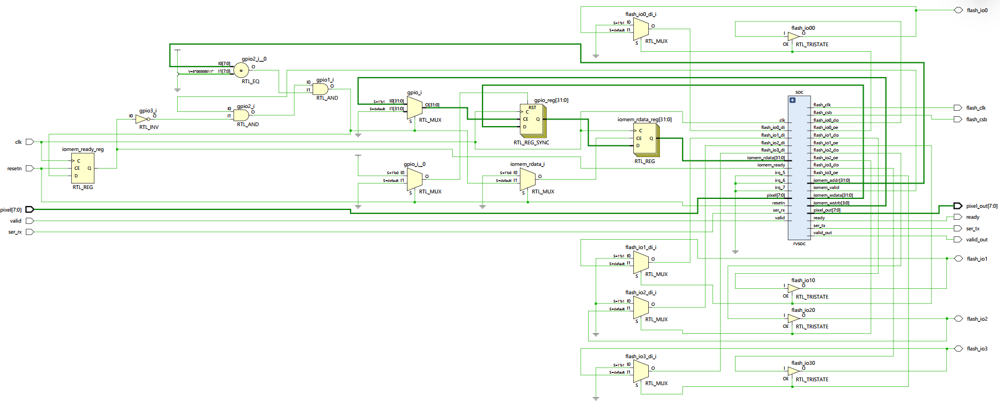

### Simulation Results :

- Simulation waveforms for each mode:
    - Mode 0: The output of the processor(pixel_out) must bypass the incoming pixels (but with a certain delay). According to the testbench used, the pixel's value increase with time as they are incremented by 1. Hence pixel_out's value must "increase" too.

    

    - Mode 1: The output of the processor(pixel_out) must invert the bits of incoming pixels. According to the testbench used, the pixel's value increase with time as they are incremented by 1. Hence pixel_out's value must "decrease". The trend can be seen by observing the mode_reg row in the waveform.

    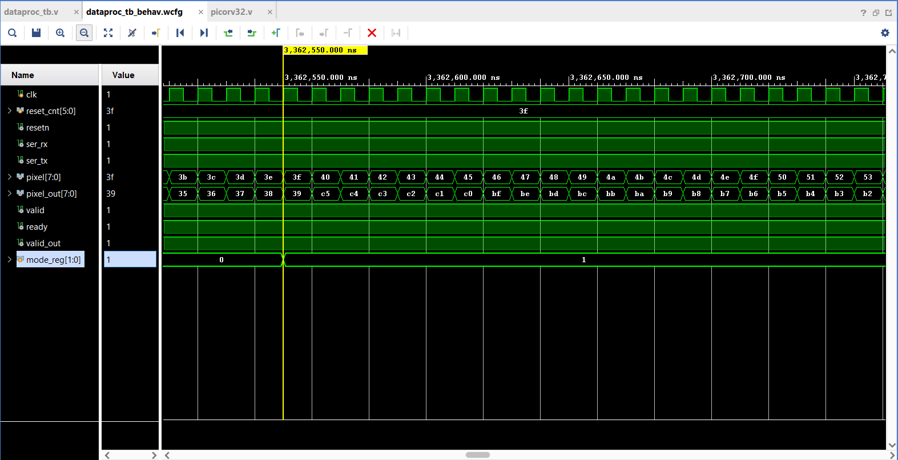

    - Mode 2: The output of the processor(pixel_out) must be equal to incoming pixels as the kernel being used is an identity matrix. According to the testbench used, the pixel's value increase with time as they are incremented by 1. Hence pixel_out's value must "increase" too. The trend can be seen by observing the mode_reg row in the waveform.

    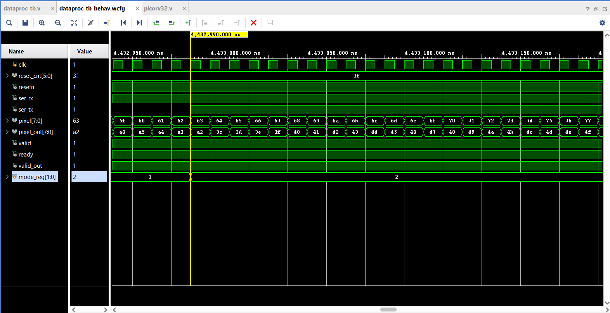

### Terminal/tcl Outputs

Results printed on the terminal due to the UART module of the RISC V SoC. (Click the below text)

<strong> Click to view complete terminal output </strong>

                
                Serial data:  13
                Serial data:  10
                Serial data: '-'
                Serial data: '-'
                Serial data: '-'
                Serial data: '-'
                Serial data: '-'
                Serial data: '-'
                Serial data: '-'
                Serial data: '-'
                Serial data: '-'
                Serial data: '-'
                Serial data: '-'
                Serial data: '-'
                Serial data: '-'
                Serial data: '-'
                Serial data: '-'
                Serial data: '-'
                Serial data: '-'
                Serial data: '-'
                Serial data: '-'
                Serial data: '-'
                Serial data: '-'
                Serial data: '-'
                Serial data: '-'
                Serial data: '-'
                Serial data: '-'
                Serial data: '-'
                Serial data: '-'
                Serial data: '-'
                Serial data: '-'
                Serial data: '-'
                Serial data: '-'
                Serial data: '-'
                Serial data: '-'
                Serial data: '-'
                Serial data:  13
                Serial data:  10
                Serial data: 'S'
                Serial data: 'T'
                Serial data: 'A'
                Serial data: 'R'
                Serial data: 'T'
                Serial data: 'I'
                Serial data: 'N'
                Serial data: 'G'
                Serial data: ' '
                Serial data: 'H'
                Serial data: 'A'
                Serial data: 'R'
                Serial data: 'D'
                Serial data: 'W'
                Serial data: 'A'
                Serial data: 'R'
                Serial data: 'E'
                Serial data: ' '
                Serial data: 'T'
                Serial data: 'E'
                Serial data: 'S'
                Serial data: 'T'
                Serial data:  13
                Serial data:  10
                Serial data: '-'
                Serial data: '-'
                Serial data: '-'
                Serial data: '-'
                Serial data: '-'
                Serial data: '-'
                Serial data: '-'
                Serial data: '-'
                Serial data: '-'
                Serial data: '-'
                Serial data: '-'
                Serial data: '-'
                Serial data: '-'
                Serial data: '-'
                Serial data: '-'
                Serial data: '-'
                Serial data: '-'
                Serial data: '-'
                Serial data: '-'
                Serial data: '-'
                Serial data: '-'
                Serial data: '-'
                Serial data: '-'
                Serial data: '-'
                Serial data: '-'
                Serial data: '-'
                Serial data: '-'
                Serial data: '-'
                Serial data: '-'
                Serial data: '-'
                Serial data: '-'
                Serial data: '-'
                Serial data: '-'
                Serial data: '-'
                Serial data:  13
                Serial data:  10
                Serial data: 'S'
                Serial data: 'e'
                Serial data: 't'
                Serial data: 't'
                Serial data: 'i'
                Serial data: 'n'
                Serial data: 'g'
                Serial data: ' '
                Serial data: 'M'
                Serial data: 'o'
                Serial data: 'd'
                Serial data: 'e'
                Serial data: ':'
                Serial data: ' '
                Serial data: 'B'
                Serial data: 'Y'
                Serial data: 'P'
                Serial data: 'A'
                Serial data: 'S'
                Serial data: 'S'
                Serial data: ' '
                Serial data: '('
                Serial data: '0'
                Serial data: ')'
                Serial data: '.'
                Serial data: '.'
                Serial data: '.'
                Serial data:  13
                Serial data:  10
                Serial data: 170
                Serial data: 245
                Serial data: '@'
                Serial data: 139
                Serial data: 214
                Serial data: '!'
                Serial data: 'l'
                Serial data: 183
                Serial data:   2
                Serial data: 'M'
                Serial data: 152
                Serial data: 227
                Serial data: '.'
                Serial data: 'y'
                Serial data: 196
                Serial data:  15
                Serial data: 'D'
                Serial data: 'o'
                Serial data: 'n'
                Serial data: 'e'
                Serial data: '.'
                Serial data:  13
                Serial data:  10
                Serial data:  13
                Serial data:  10
                Serial data: 'S'
                Serial data: 'e'
                Serial data: 't'
                Serial data: 't'
                Serial data: 'i'
                Serial data: 'n'
                Serial data: 'g'
                Serial data: ' '
                Serial data: 'M'
                Serial data: 'o'
                Serial data: 'd'
                Serial data: 'e'
                Serial data: ':'
                Serial data: ' '
                Serial data: 'I'
                Serial data: 'N'
                Serial data: 'V'
                Serial data: 'E'
                Serial data: 'R'
                Serial data: 'T'
                Serial data: ' '
                Serial data: '('
                Serial data: '1'
                Serial data: ')'
                Serial data: '.'
                Serial data: '.'
                Serial data: '.'
                Serial data:  13
                Serial data:  10
                Serial data: 238
                Serial data: 163
                Serial data: 'X'
                Serial data:  13
                Serial data: 194
                Serial data: 'w'
                Serial data: ','
                Serial data: 225
                Serial data: 150
                Serial data: 'K'
                Serial data:   0
                Serial data: 181
                Serial data: 'j'
                Serial data:  31
                Serial data: 212
                Serial data: 137
                Serial data: 'D'
                Serial data: 'o'
                Serial data: 'n'
                Serial data: 'e'
                Serial data: '.'
                Serial data:  13
                Serial data:  10
                Serial data:  13
                Serial data:  10
                Serial data: 'S'
                Serial data: 'e'
                Serial data: 't'
                Serial data: 't'
                Serial data: 'i'
                Serial data: 'n'
                Serial data: 'g'
                Serial data: ' '
                Serial data: 'M'
                Serial data: 'o'
                Serial data: 'd'
                Serial data: 'e'
                Serial data: ':'
                Serial data: ' '
                Serial data: 'C'
                Serial data: 'O'
                Serial data: 'N'
                Serial data: 'V'
                Serial data: 'O'
                Serial data: 'L'
                Serial data: 'U'
                Serial data: 'T'
                Serial data: 'I'
                Serial data: 'O'
                Serial data: 'N'
                Serial data: ' '
                Serial data: '('
                Serial data: '2'
                Serial data: ')'
                Serial data: '.'
                Serial data: '.'
                Serial data: '.'
                Serial data:  13
                Serial data:  10
                Serial data:  10
                Serial data: 'U'
                Serial data: 160
                Serial data: 235
                Serial data: '6'
                Serial data: 129
                Serial data: 204
                Serial data:  23
                Serial data: 'b'
                Serial data: 173
                Serial data: 248
                Serial data: 'C'
                Serial data: 142
                Serial data: 217
                Serial data: '$'
                Serial data: 'o'
                Serial data: 'D'
                Serial data: 'o'
                Serial data: 'n'
                Serial data: 'e'
                Serial data: '.'
                Serial data:  13
                Serial data:  10
                Serial data:  13
                Serial data:  10
                Serial data: 'A'
                Serial data: 'L'
                Serial data: 'L'
                Serial data: ' '
                Serial data: 'T'
                Serial data: 'E'
                Serial data: 'S'
                Serial data: 'T'
                Serial data: 'S'
                Serial data: ' '
                Serial data: 'C'
                Serial data: 'O'
                Serial data: 'M'
                Serial data: 'P'
                Serial data: 'L'
                Serial data: 'E'
                Serial data: 'T'
                Serial data: 'E'
                Serial data: '.'
                Serial data:  13
                Serial data:  10

 

## Optimizations:
***All the optimizations from Part B are still valid here.***

    DIRECT MEMORY ACCESS / DMA CONTROLLER

*Please find the "dma-integration" branch to see the correspponding modules. Only the description and simulation results are shown in this README file. The README file in the branch contains more details on the DMA design process*

### Design Process:
- In practical scenarios, the CPU carries out multiple functions like data transfer, running programs, handling heavy mathematics, etc. Hence at some points, it might compromise on the performance/throughput just to get all the work done together. To improve the efficiency of the CPU and more importantly, the speed of data transfer, DMA controller is introduced into the system.
- Initially, I built a standalone DMA Controller project with standard handshake mechanism, ensuring the design was compatible with the SoC given. The DMA supports both burst mode and cycle stealing mode of data transfer. Currently, the burst mode is being implemented as it is the most suitable for our use case in this assignment. (To switch to cycle stealing mode, comment out the corresponding logic) 
- The first version I built was a "Memory-to-memory (M2M) Controller" i.e. an auto-increment logic for memory addresses was hardcoded for both source and destination, after every data transfer. This works only while transferring data which are stored in RAM arrays. But this version is NOT compatible with our SoC, especially our processor because it outputs data from a fixed address. So this version, after the first pixel_out would go to the next address to read the data but it would just obtain wrong/garbage values.
- To solve this problem, "Stream to Memory" and "Stream to Stream" controller was to be implemented i.e. souce sending data and destination receiving data from a single fixed address was supported. Hence, a MUX was added to the address increment logic, which decides whether to stay in the Fixed Address mode or not. 

### Integration with the SoC: 
*(All the modules being talked about here, correspond to the ones in the branch)*
- Since the DMA is responsible for the data transfer, all the connections between the CPU and other blocks of the SoC must be modified. 
- In the rvsoc.v, the selector, output data and ready signals of the DMA are memory-mapped (0x0500_0000). The DMA interrupt is connected to one of the interrupt pins of the module (irq_6). The mem_ready logic is changed to include the DMA logic, so are the other module instantiations. 
- Since DMA is an internal block only, none of its pins show up as ports of the SoC. Thus, no change in the rvsoc_wrapper module. 
- No change in the start.s, sections.ld, Makefile. Only the firmware should now include the memory mapped registers of the DMA.

### DMA Controller Schematic : 
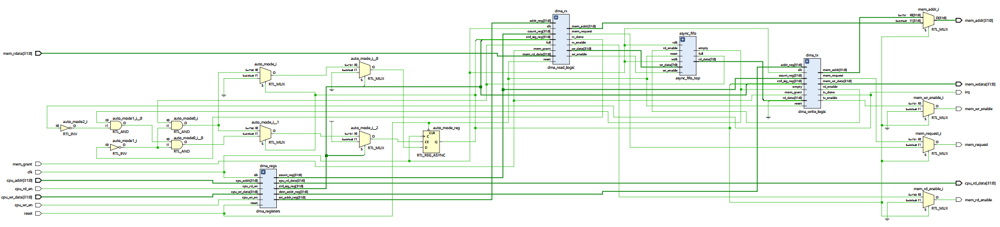

### Terminal Outputs:

<strong> Click to view complete terminal output </strong>

                VCD info: dumpfile dataproc_tb.vcd opened for output.
                Serial data:  13
                Serial data:  10
                Serial data: '='
                Serial data: '='
                Serial data: '='
                Serial data:  13
                Serial data:  10
                Serial data: ' '
                Serial data: ' '
                Serial data: ' '
                Serial data: ' '
                Serial data: ' '
                Serial data: ' '
                Serial data: 'S'
                Serial data: 'O'
                Serial data: 'C'
                Serial data: ' '
                Serial data: 'D'
                Serial data: 'M'
                Serial data: 'A'
                Serial data: ' '
                Serial data: 'S'
                Serial data: 'Y'
                Serial data: 'S'
                Serial data: 'T'
                Serial data: 'E'
                Serial data: 'M'
                Serial data: ' '
                Serial data: 'T'
                Serial data: 'E'
                Serial data: 'S'
                Serial data: 'T'
                Serial data: ' '
                Serial data: ' '
                Serial data: ' '
                Serial data: ' '
                Serial data: ' '
                Serial data: ' '
                Serial data: ' '
                Serial data: ' '
                Serial data: ' '
                Serial data:  13
                Serial data:  10
                Serial data: '='
                Serial data: '='
                Serial data: '='
                Serial data:  13
                Serial data:  10
                Serial data:  13
                Serial data:  10
                Serial data: '['
                Serial data: 'T'
                Serial data: 'E'
                Serial data: 'S'
                Serial data: 'T'
                Serial data: ' '
                Serial data: '1'
                Serial data: ']'
                Serial data: ' '
                Serial data: 'M'
                Serial data: 'o'
                Serial data: 'd'
                Serial data: 'e'
                Serial data: ':'
                Serial data: ' '
                Serial data: 'B'
                Serial data: 'Y'
                Serial data: 'P'
                Serial data: 'A'
                Serial data: 'S'
                Serial data: 'S'
                Serial data: ' '
                Serial data: '('
                Serial data: '0'
                Serial data: ')'
                Serial data: '.'
                Serial data: '.'
                Serial data: '.'
                Serial data:  13
                Serial data:  10
                Serial data: 'D'
                Serial data: 'M'
                Serial data: 'A'
                Serial data: ' '
                Serial data: 'F'
                Serial data: 'i'
                Serial data: 'n'
                Serial data: 'i'
                Serial data: 's'
                Serial data: 'h'
                Serial data: 'e'
                Serial data: 'd'
                Serial data: '.'
                Serial data: ' '
                Serial data: 'R'
                Serial data: 'e'
                Serial data: 's'
                Serial data: 'u'
                Serial data: 'l'
                Serial data: 't'
                Serial data: 's'
                Serial data: ':'
                Serial data:  13
                Serial data:  10
                Serial data: 'u'
                Serial data: 'v'
                Serial data: 'w'
                Serial data: 'x'
                Serial data: 'y'
                Serial data: 'z'
                Serial data: '{'
                Serial data:   0
                Serial data: '_'
                Serial data: '`'
                Serial data: 'a'
                Serial data: 'b'
                Serial data: 'c'
                Serial data: 'd'
                Serial data: 'e'
                Serial data: 'q'
                Serial data:  13
                Serial data:  10
                Serial data:  13
                Serial data:  10
                Serial data: '['
                Serial data: 'T'
                Serial data: 'E'
                Serial data: 'S'
                Serial data: 'T'
                Serial data: ' '
                Serial data: '2'
                Serial data: ']'
                Serial data: ' '
                Serial data: 'M'
                Serial data: 'o'
                Serial data: 'd'
                Serial data: 'e'
                Serial data: ':'
                Serial data: ' '
                Serial data: 'I'
                Serial data: 'N'
                Serial data: 'V'
                Serial data: 'E'
                Serial data: 'R'
                Serial data: 'T'
                Serial data: ' '
                Serial data: '('
                Serial data: '1'
                Serial data: ')'
                Serial data: '.'
                Serial data: '.'
                Serial data: '.'
                Serial data:  13
                Serial data:  10
                Serial data: 'D'
                Serial data: 'M'
                Serial data: 'A'
                Serial data: ' '
                Serial data: 'F'
                Serial data: 'i'
                Serial data: 'n'
                Serial data: 'i'
                Serial data: 's'
                Serial data: 'h'
                Serial data: 'e'
                Serial data: 'd'
                Serial data: '.'
                Serial data: ' '
                Serial data: 'R'
                Serial data: 'e'
                Serial data: 's'
                Serial data: 'u'
                Serial data: 'l'
                Serial data: 't'
                Serial data: 's'
                Serial data: ':'
                Serial data:  13
                Serial data:  10
                Serial data: 187
                Serial data: 187
                Serial data: 187
                Serial data: 187
                Serial data: 187
                Serial data: 187
                Serial data: 187
                Serial data: 187
                Serial data: 187
                Serial data: 187
                Serial data: 187
                Serial data: 187
                Serial data: 187
                Serial data: 187
                Serial data: 187
                Serial data: 187
                Serial data:  13
                Serial data:  10
                Serial data:  13
                Serial data:  10
                Serial data: '['
                Serial data: 'T'
                Serial data: 'E'
                Serial data: 'S'
                Serial data: 'T'
                Serial data: ' '
                Serial data: '3'
                Serial data: ']'
                Serial data: ' '
                Serial data: 'M'
                Serial data: 'o'
                Serial data: 'd'
                Serial data: 'e'
                Serial data: ':'
                Serial data: ' '
                Serial data: 'C'
                Serial data: 'O'
                Serial data: 'N'
                Serial data: 'V'
                Serial data: 'O'
                Serial data: 'L'
                Serial data: 'U'
                Serial data: 'T'
                Serial data: 'I'
                Serial data: 'O'
                Serial data: 'N'
                Serial data: ' '
                Serial data: '('
                Serial data: '2'
                Serial data: ')'
                Serial data: '.'
                Serial data: '.'
                Serial data: '.'
                Serial data:  13
                Serial data:  10
                Serial data: 'D'
                Serial data: 'M'
                Serial data: 'A'
                Serial data: ' '
                Serial data: 'F'
                Serial data: 'i'
                Serial data: 'n'
                Serial data: 'i'
                Serial data: 's'
                Serial data: 'h'
                Serial data: 'e'
                Serial data: 'd'
                Serial data: '.'
                Serial data: ' '
                Serial data: 'R'
                Serial data: 'e'
                Serial data: 's'
                Serial data: 'u'
                Serial data: 'l'
                Serial data: 't'
                Serial data: 's'
                Serial data: ':'
                Serial data:  13
                Serial data:  10
                Serial data: 204
                Serial data: 204
                Serial data: 204
                Serial data: 204
                Serial data: 204
                Serial data: 204
                Serial data: 204
                Serial data: 204
                Serial data: 204
                Serial data: 204
                Serial data: 204
                Serial data: 204
                Serial data: 204
                Serial data: 204
                Serial data: 204
                Serial data: 204
                Serial data:  13
                Serial data:  10
                Serial data:  13
                Serial data:  10
                Serial data: '='
                Serial data: '='
                Serial data: '='
                Serial data: '='
                Serial data: '='
                Serial data: '='
                Serial data: '='
                Serial data: '='
                Serial data: '='
                Serial data: '='
                Serial data: '='
                Serial data: '='
                Serial data: '='
                Serial data: '='
                Serial data: '='
                Serial data: '='
                Serial data: '='
                Serial data: '='
                Serial data: '='
                Serial data: '='
                Serial data: '='
                Serial data: '='
                Serial data: '='
                Serial data: '='
                Serial data: '='
                Serial data: '='
                Serial data: '='
                Serial data: '='
                Serial data: '='
                Serial data: '='
                Serial data: '='
                Serial data: '='
                Serial data: '='
                Serial data: '='
                Serial data:  13
                Serial data:  10
                Serial data: ' '
                Serial data: ' '
                Serial data: ' '
                Serial data: ' '
                Serial data: ' '
                Serial data: ' '
                Serial data: 'A'
                Serial data: 'L'
                Serial data: 'L'
                Serial data: ' '
                Serial data: 'T'
                Serial data: 'E'
                Serial data: 'S'
                Serial data: 'T'
                Serial data: 'S'
                Serial data: ' '
                Serial data: 'C'
                Serial data: 'O'
                Serial data: 'M'
                Serial data: 'P'
                Serial data: 'L'
                Serial data: 'E'
                Serial data: 'T'
                Serial data: 'E'
                Serial data: ' '
                Serial data: ' '
                Serial data: ' '
                Serial data: ' '
                Serial data: ' '
                Serial data: ' '
                Serial data: ' '
                Serial data: ' '
                Serial data: ' '
                Serial data: ' '
                Serial data:  13
                Serial data:  10
                Serial data: '='
                Serial data: '='
                Serial data: '='
                Serial data: '='
                Serial data: '='
                Serial data: '='
                Serial data: '='
                Serial data: '='
                Serial data: '='
                Serial data: '='
                Serial data: '='
                Serial data: '='
                Serial data: '='
                Serial data: '='
                Serial data: '='
                Serial data: '='
                Serial data: '='
                Serial data: '='
                Serial data: '='
                Serial data: '='
                Serial data: '='
                Serial data: '='
                Serial data: '='
                Serial data: '='
                Serial data: '='
                Serial data: '='
                Serial data: '='
                Serial data: '='
                Serial data: '='
                Serial data: '='
                Serial data: '='
                Serial data: '='
                Serial data: '='
                Serial data: '='
                Serial data:  13
                Serial data:  10

 

***The waveform simulation of the DMA runs only for Mode 0, even though UART prints results for all modes on the console. Still under debugging process***

 

## References: 
- Part A:
    - CDC:
      - Clock Domain Crossing (CDC) Design & Verification Techniques Using SystemVerilog by Clifford E. Cummings 
      - Youtube: Electronicspedia 
      - https://thedatabus.in/cdc_complete_guide/

- Part B:
    - Register mapping: https://www.youtube.com/watch?v=gax3yg27doc
    - Asynchronous FIFO: https://youtu.be/4CITOSUUMRI?si=n8EK9veopwv66B7U

- DMA Controller:
    - https://www.youtube.com/watch?v=s8RGHggL7ws
    - https://www.youtube.com/watch?v=gGB-X3KmAZU&t=338s
    
- Testbench and debugging:  
    - Gemini
